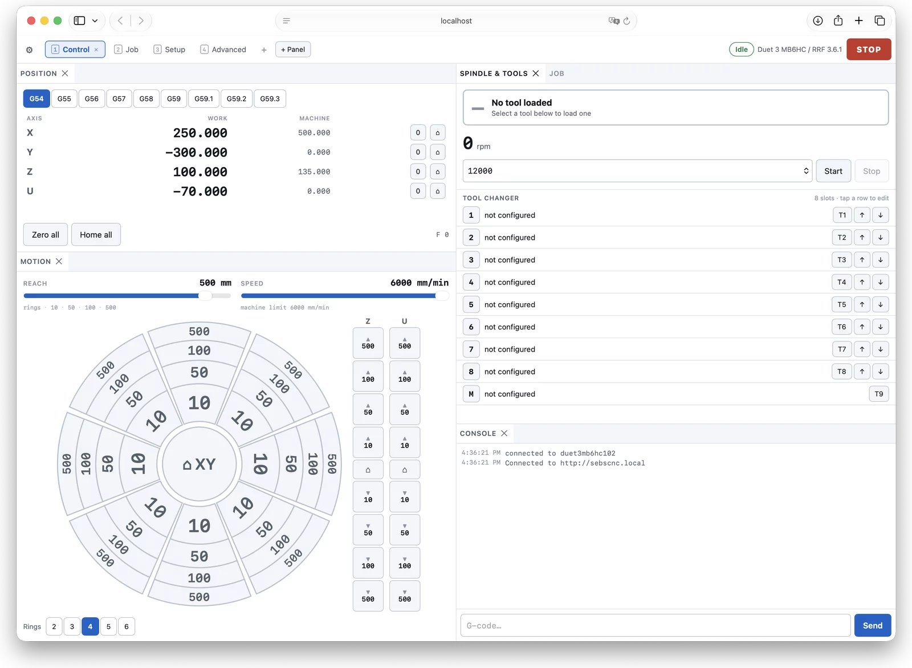
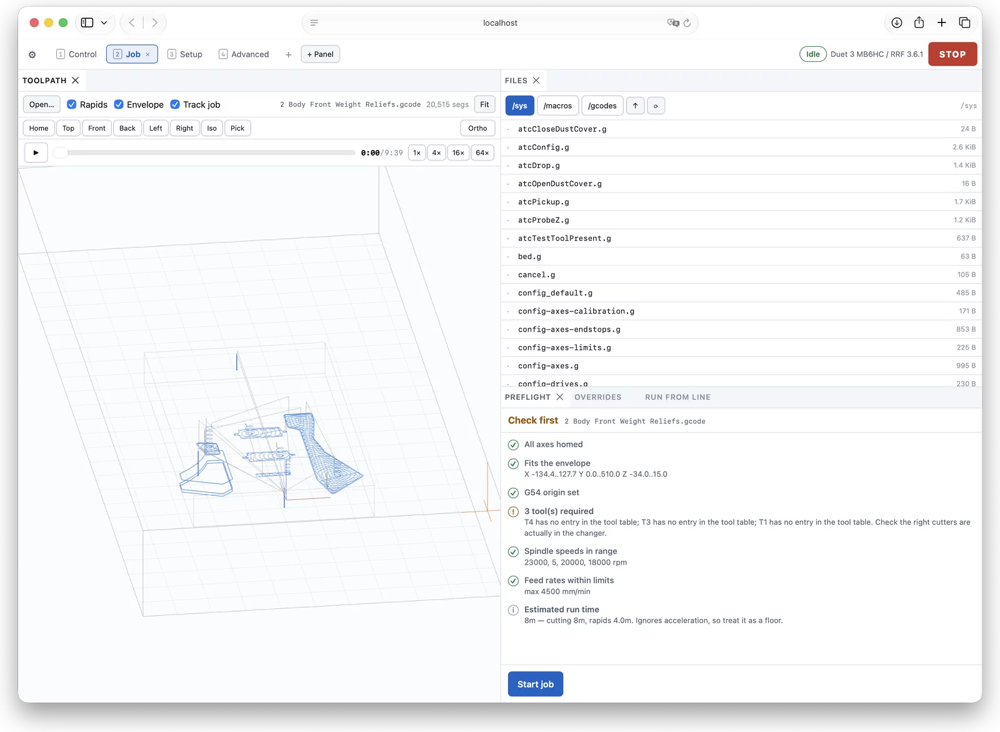
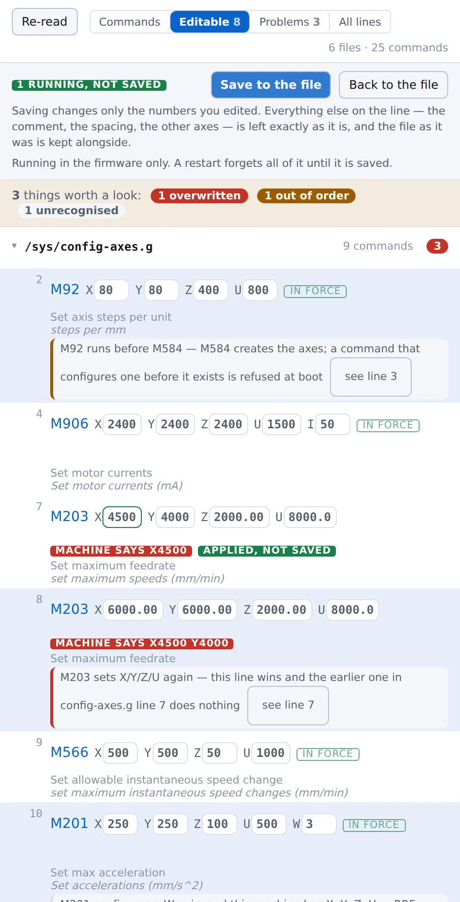
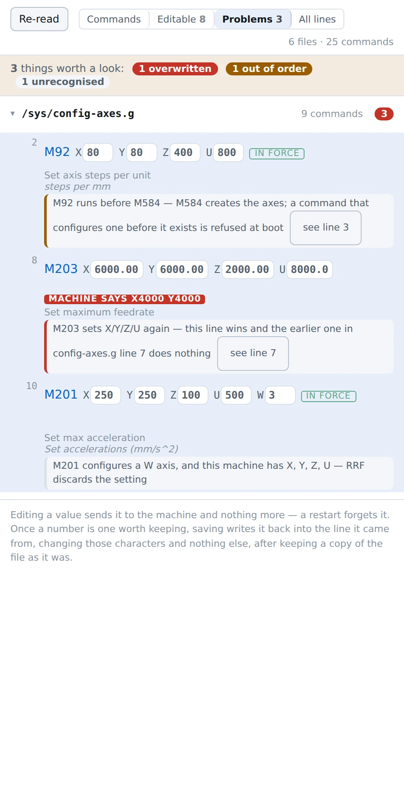

# Axis Control

A CNC-first web front end for RepRapFirmware controllers.





DWC is an excellent 3D-printer interface, and that is the problem: on a router
its information architecture is shaped around a machine that does a different
job. Axis Control is arranged around the things a CNC operator actually reaches
for — work coordinates, jogging, tool length, probing, and watching a program
run — and it is honest about what the controller can and cannot do rather than
showing buttons that quietly fail.

It is written against RepRapFirmware's documented HTTP API, contains no DWC or
RRF code, and is not a replacement for either: firmware updates, the config
tool and network setup are all still DWC's job, and DWC stays installed at `/`.

> **This drives machinery that can injure you.** It moves a spindle and a
> gantry, and it will do exactly what it is told. Nothing here replaces your own
> judgement: verify every generated program before you run it, keep a hand on
> the stop, and treat the simulation as a drawing rather than a promise. See the
> warranty and liability sections of [LICENSE](LICENSE).

## What it does that the alternatives do not

Four things, roughly in order of how much they change a day at the machine.

### It reads your configuration and tells you what is wrong with it



RRF runs `config.g` top to bottom and mostly does not complain. Set the same
maximum speed twice and the second silently wins. Configure an axis before the
`M584` that creates it and the line is refused at boot with nobody watching.
Misspell a parameter and it is ignored. Each leaves a machine that runs,
behaves differently from what the file appears to say, and offers no clue why.

The Configuration panel follows `config.g` through every `M98` **and** through
the `M501` into `config-override.g`, in the order the firmware actually runs
them — a fragment called from the middle of `config.g` runs before the lines
below the call, and getting that backwards means naming the wrong line as the
winner. Then it says what it found:



Beside every value it shows what the machine is *actually* running, read from
the object model. A line that reads correctly and is not in force — overridden
by `config-override.g`, replaced by a later duplicate, changed at the console
and never saved — is the failure this is for, and it is the one nothing else
shows you.

### It collapses the tuning loop from minutes to seconds

Edit, restart, feel it, edit again. That loop exists only because the file is
the only way anyone offers to change acceleration or jerk or motor current. So
don't use the file: type a number, press **Try on the machine**, and it is in
force before the file has been touched at all. Nothing is written; `M999`
undoes everything.

When the number is one worth keeping, **Save to the file** writes it back into
the line it came from, changing those characters and nothing else — your
alignment spaces, your comments, your commented-out previous values and your
line endings all come through byte for byte, because a config file people
hand-edit has to still look like theirs afterwards. It re-reads first and
refuses if the file changed underneath, keeps a `.bak` before the first write
of the session, and reads back what it wrote.

You can also add a line, comment one out, or delete one. The add box takes any
text and validates it on every keystroke in the position it would occupy — a
second `M203` that would overwrite the first, a parameter for an axis you do
not have, a command the reference has never heard of: all refused, with the
reason, before anything is written.

### It tracks a running job against the toolpath, to the byte

The G-code parser records the source byte offset on every vertex. RRF reports
`job.filePosition` as a byte offset, so comparing the two in the fragment
shader draws the cut/uncut boundary and places the live cutter exactly. A
parser that discards offsets can draw a toolpath but can never follow a job.
Run-from-line picks the restart point off the drawing, which is what you want
after a broken cutter.

### It works on the phone in your pocket

Below 700px wide — or 500px tall, which is a phone turned sideways — the
dashboard stops tiling. A strip of panel names replaces the layout and the
panel you tap gets the whole screen, which is what makes the jog rose legible
at 390px rather than merely uncut.

There is a panel built for exactly that moment: **At the machine** puts the
position readout and an eight-direction jog pad on one screen, with the other
axes as columns beside it and the step size a row of five buttons. Portrait
stacks them, landscape puts them side by side. Nothing else — no speed slider,
no coordinate systems. You are standing at the machine holding a phone in one
hand, and the only two things that matter are where it is and moving it a bit.

Installed to the home screen it runs full screen with no address bar.

### It engraves text without going near CAM

A name on a fixture, a scale beside a slot, "MAX 24V" under a socket. Type it,
see it drawn to scale with the work origin marked, cut it — six single-stroke
faces from Hershey's 1967 set, which suit this exactly because a Hershey glyph
is *already* a sequence of pen-up and pen-down moves. The toolpath IS the
letter, so nothing is offset or approximated on the way to G-code, and no font
file is loaded: 45KB of glyph data ships inside the app and works with the
machine unplugged from the world.

Outline fonts and V-carving are a different operation and are not built yet.

### It jogs by speed, not by distance

Every web front end for RRF moves the machine by picking a distance and pressing
a button, because that is all the firmware offered. Hold the button and it fires
the same short move over and over — the queue fills, the control goes numb, and
the machine carries on after you let go.

The **Jog** panel is a thumbstick instead: deflection is speed, push further to
go faster, let go and it stops. It needs `M700`, which is not in stock
RepRapFirmware — it is in the [`meeloo/RepRapFirmware`][fork] fork on branch
`feature/velocity-jog`, and the panel asks the board whether it has it before
showing anything. The distance rose is still there for machines that do not.

Velocity control puts the safety burden on the host, so: the vector is resent
thirty times a second — silence for 250ms and the firmware stops the machine by
itself — releasing sends an explicit zero and sends it again behind anything
still in flight, and losing the window, the tab, the pointer, the panel or the
connection is a stop. Arrow keys work the same way while the panel has focus.

Two ceilings apply to any commanded speed, and neither produces an error: the
axis maximum from `M203`, and `2 × acceleration × lookahead`, which is the
planner refusing to enter a move faster than it could stop inside it. Ask for
more and the machine simply runs slower. So the panel computes both, shows the
binding one, and scales the whole vector to fit rather than trimming each axis
— clamping axis by axis is what the firmware does and it bends the heading, so
the machine ends up moving somewhere other than where your thumb is pointing.

[fork]: https://github.com/meeloo/RepRapFirmware/tree/feature/velocity-jog

### It is honest about what it cannot do

Panels hide themselves when the controller cannot back them, rather than
showing buttons that fail. A camera that sends no CORS headers is marked
**blind** and does the half that needs no reply. A line carrying an expression
or sitting inside an `if` is shown and marked not-editable rather than guessed
at. Three probing flows — tool length, workpiece, feature — are three different
jobs and are never conflated.

## The panels

Twenty-seven, arranged onto pages you lay out yourself.

- **Jog** — a thumbstick that moves the machine at the speed you push it,
  continuously, for as long as you hold it (needs `M700`; hidden without it)
- **Motion** — a jog rose of concentric rings, eight directions each, with
  distances that are always numbers a person would choose
- **At the machine** — position and jogging on one phone screen, in either
  orientation
- **Text** — engrave a line of text, six single-stroke faces, no CAM
- **Configuration** — the above
- **Toolpath** — WebGL viewer with live cutter tracking, a time slider,
  run-from-line picking, and the actual cutter drawn to size
- **Probing** — tool length, corner, edge and feature, kept separate
- **Spindle & Tools** — the active tool stated large, ATC slots, and tool
  libraries importable straight from a Fusion 360 `.tools` export
- **Position** and **Coordinates** — work and machine coordinates, WCS
  selection (G54–G59.3), zeroing, offsets, names and rotation
- **Tool changer** — set up a RapidChange ATC and install its macros: pocket
  geometry checked against the machine's own travel, every file shown before it
  is written, and nothing run for you
- **Preflight** — check a job against the machine before starting it
- **Run from line** — restart a job partway through
- **Machining**, **Surface**, **Import** — conversational facing, contours and
  pockets without CAM; probe a height map and compensate Z against it; SVG/DXF
  import with tool-radius offsetting
- **Camera** — live H.264 over HTTP-FLV where the camera allows it, pipelined
  stills where it does not, with pan/tilt and lighting for Reolink. Click the
  picture to bring that point to the middle, double-click to zoom in on it
- **G-code reference** — the whole RRF dictionary, searchable, offline, and
  installed on the machine with everything else
- **Install** — serve Axis Control from the controller and keep it updated
- **Overrides**, **Job**, **Console**, **Files**, **Macros**, **Machine Model**,
  **Diagnostics**, **Firmware**

Every field that holds a position has a crosshair beside it that fills it in
from where the machine is standing — in machine or work coordinates, whichever
that field actually means, and refused with a reason when the axis it needs is
not homed. Depths and diameters take it too: jog down to depth, or out to the
wall, and press the button.

Dependencies, all permissive: Lit for templating, dockview for the layout,
clipper-lib for polygon offsetting, and mpegts.js for camera video — the last
loaded only when video is actually attempted. About 225 KB gzipped for the app,
plus 62 KB for the video demuxer if it is ever needed.

```
npm install
npm run dev        # esbuild watch + dev server on :8000 (PORT=9000 to move it)
npm run build      # dist/, with .gz siblings for the controller
npm run typecheck
```

Or the three you actually want day to day, which run from anywhere and do not
have to be remembered:

```
./tools/run           # build, then watch and serve
./tools/updateRun     # git pull first, for a machine that is behind
./tools/bumpVersion   # npm version patch, and push the commit with its tag
```

## If the camera's replies cannot be read

A Reolink answers every request but sends no `Access-Control-Allow-Origin`, and
without that header a browser will not hand the reply to a page served from
anywhere else. It is not a camera setting — the firmware is built for Reolink's
own app and for NVRs, neither of which is a browser — so the panel says
**blind** and works from what it can do without an answer.

That is most of it. Commands need no reply: pan, tilt, presets, zoom by the
buttons, click-to-aim, IR and the spotlight. What needs an answer does not work:
the model, the live state of those controls, preset names, day/night (which has
to read the whole image block before writing it back), the zoom slider, and live
video — which unlike the snapshots is an ordinary fetch.

Forwarding the same requests through something that does add the header gets all
of it back:

```
npm run camera-proxy -- http://192.168.1.40      # listens on :8100
```

Then point the camera panel at `http://<that-host>:8100` instead of the camera.
Run it somewhere that is always on — a Pi, a NAS, whatever serves the app — not
a laptop that sleeps. It adds no authentication of its own, so put it only where
you would be willing to expose the camera itself.

## Developing without the machine

```
node tools/mock-rrf.mjs        # mock controller on :8081, also serves dist/
node tools/mock-camera.mjs 8090        # camera, no CORS headers
node tools/mock-camera.mjs 8091 --cors # camera, CORS headers
```

The mocks are deliberately unkind. Over the course of building this they grew
every trap the real hardware sprang: sparse arrays with genuine holes, replies
in mm/s where the docs imply mm/min, a directory long enough to need scrolling,
an endpoint that accepts a connection and then says nothing at all. Each one is
there because something shipped broken without it.

The mock implements the `rr_*` endpoints against a synthetic object model
shaped like the real Ultimate Bee: X/Y/Z plus the U dust-shoe axis, a
0–24000 rpm VFD spindle, the 8-slot RapidChange ATC, and the `atc*`/`dustShoe*`
globals a real ATC configuration declares. It simulates motion and job progress, so the DRO
moves and the viewer's live cutter tracking has something to follow. Two sample
programs are included, one with arcs and a full circle to exercise the
tessellator.

It also implements `M700` velocity jogging, including the two parts a host has
to be written against and cannot see without them: the watchdog that stops the
machine when commands stop arriving, and the silent clamping of any speed above
`2 × acceleration × lookahead`. `GET /__jog` reports what the board thinks is
happening — the commanded speeds, the clamped ones, and why it last stopped —
which is how `npm run velocity-check` tells a stop that was *sent* from one the
watchdog cleaned up 250ms later.

Open <http://localhost:8081> and it connects to itself.

## Deploying to the controller

Easiest is the **Install** panel, which copies the running copy across for you
and writes the redirect described below. By hand, either host it anywhere on
the LAN and point it at the controller, or copy `dist/` onto the SD card:

```
cp -r dist/* /path/to/sd/www/axis/
```

then browse to `http://<controller>/axis/index.html` — **`index.html` and not
just `/axis/`**. RRF maps `/` to `/www/index.html`, which is how browsing to a
Duet gets you DWC, but it does not do the same for any other directory: a
request for `/axis/` is a request for a file called `axis/`, and there is no
such file.

Two ways round it, if typing the whole path is tiresome:

- Put a one-line redirect beside the directory, at `/www/axis.html`, so
  `http://<controller>/axis.html` works. This is what the Install panel's
  shortcut option writes — a `<meta http-equiv="refresh">`, which needs no
  scripting and is understood by everything.
- Or replace DWC outright by copying `dist/` into `/www` itself, after which
  `/` serves this instead. Worth thinking twice about: DWC is the fallback for
  when *this* is the thing that is broken, and firmware updates and network
  setup are still its job.

Ship the `.gz` files alongside the originals; the Duet serves them when the
browser sends `Accept-Encoding: gzip`, which matters because it reads off the
SD card single-threaded.

Served from anywhere other than the controller, cross-origin rules apply, so
the controller needs `M586 C"*"` in its network config. Note what that does
*not* fix: RRF answers a CORS preflight with nothing useful, so cross-origin
requests must stay inside the CORS-simple envelope — which is why the driver
drops the session-key header and falls back to RRF's implicit per-IP session
when it is not same-origin.

On iOS, Share → Add to Home Screen runs it full screen with no address bar.

## Architecture

```
src/
  core/          signals (reactivity), app store, CRC32, helpers
  machine/
    types.ts     vendor-neutral machine model — the only vocabulary panels see
    driver.ts    the MachineDriver contract
    registry.ts  driver list
    drivers/
      rrf/       RepRapFirmware: HTTP transport, object model, state mapping
      carvera/   Makera Carvera / Z1 — stub, see its README first
  config/        config.g reader, checker, in-place editor — see below
  docs/          the G-code reference, built at build time from docs.duet3d.com
  ui/            panel base class, dashboard layout, top bar, prompt dialog
  panels/        one file per panel, self-registering
  viewer/        G-code parser, WebGL2 renderer, mat4
```

### The driver layer

Panels read **only** `machine/types.ts`. Nothing above the driver layer may
import RRF object-model types or `rr_*` endpoint names. A second controller is a
new `MachineDriver` implementation, not a fork of the UI.

Each driver publishes a `Capabilities` record, and panels hide themselves when
the active controller can't back them — so a partially-implemented driver still
yields a coherent UI instead of dead buttons. The object-model browser is the
one panel that deliberately reaches through `driver.native`, gated on
`capabilities.objectModel`.

### RRF specifics

Standalone RRF has no WebSocket (reserved in the API, unimplemented — the board
has ~8 sockets and half may go to non-HTTP services). So the driver polls:

1. one cheap `rr_model?flags=d99fn` per tick for live values across the whole
   tree, plus `seqs`;
2. a full `rr_model?key=<k>&flags=d99vn` **only** for subtrees whose sequence
   number moved;
3. `rr_reply` when `seqs.reply` advances.

250 ms while active, 500 ms when idle. Replies are buffered per HTTP client on
3.5+, so running this alongside DWC and `tools/grr.py` doesn't steal output.
Sessions use `sessionKey`/`X-Session-Key` where available, falling back to
implicit per-IP sessions on older firmware.

### The configuration editor never re-prints a line

`src/config/parse.ts` records the byte offsets of every parameter's value
inside its line, and `rewriteLine` replaces exactly those characters, right to
left so the offsets stay valid. Nothing is reformatted, reordered or
normalised, and the line's original text is what gets written back with only
those characters changed. `src/config/save.ts` re-reads the file first, refuses
by name and line number if it changed underneath, keeps a `.bak`, and reads
back what it wrote.

The checker in `src/config/check.ts` builds its sequence by walking the include
tree — into each `M98` where the call is, and into `config-override.g` at the
`M501` — because concatenating the files instead gets both cross-file questions
backwards rather than merely missing them.

### Why the byte offset matters

The parser records the **source byte offset** on every vertex. RRF reports
`job.filePosition` as a byte offset, so comparing the two in the fragment shader
is what draws the cut/uncut boundary and places the live cutter. A parser that
discards offsets can draw a toolpath but can never track a running job.

## Adding a controller

1. Implement `MachineDriver` under `src/machine/drivers/<name>/`.
2. Set `Capabilities` honestly as you go.
3. Register a factory in `src/machine/registry.ts`.

No panel changes. See `drivers/carvera/README.md` — note especially that the
Carvera/Z1 speaks raw TCP or USB serial rather than HTTP, so it needs WebSerial
or a small WebSocket⇄TCP bridge. `connect(config)` takes a URL string precisely
so that choice stays inside the driver.

## Status

Used daily on one machine — a 750x1500 router with an 8-slot RapidChange ATC, a
2.2kW spindle on a Huangyang VFD, and a U-axis dust shoe — which is to say it is
proven on a sample of exactly one. The RRF driver is complete enough for real
work; the Carvera/Z1 driver is a stub.

Known gaps: job history and an ATC carousel view. Verification is a real
headless browser driven against the mocks, plus a set of harnesses that live in
the repo and check the things whose failures are silent:

```
npm run merge-oracle    # our object-model merge against Duet3D's own implementation
npm run rewrite-check   # the in-place config edit: offsets, widths, line endings
npm run gcode-params    # which doc bullets are parameters and which are prose
npm run hershey-check   # text layout: sizes, rotation, alignment, every glyph
npm run outline-check   # outline fonts: cap height, contour winding, flattening
npm run vcarve-check    # V-carve depths against the geometry they claim
npm run steps-check     # jog labels never round up and always fit their sector
npm run fontstore-check # fonts on the card: round trip, validation, path escapes
npm run velocity-check  # velocity jogging: the stop, the watchdog, the clamps
```

`rewrite-check` takes a directory and will sweep real config files for the
invariant the config editor rests on — that every parameter is still found at
the offsets recorded for it. The browser-driven end-to-end scripts are not in
the repo yet, which is the real gap.

Browser support goes back further than you would expect: the bundle targets
ES2019, and there is a compatibility layer for Safari 12 (an iPad mini 2 makes a
fine control screen). WebGL2 is used where present and WebGL1 where it is not.

## Contributing

Issues and pull requests welcome. Two things to know:

- **The driver boundary is the point.** Panels see only `machine/types.ts`. If a
  change needs an `rr_*` endpoint name above the driver layer, it belongs in the
  driver instead.
- **Say what you verified.** This drives machinery; "should work" and "tested
  against the mock" and "ran it on my machine" are three very different claims
  and the review will ask which one it is.

## Licence

Apache-2.0 — see [LICENSE](LICENSE), [NOTICE](NOTICE) and
[THIRD-PARTY-NOTICES.md](THIRD-PARTY-NOTICES.md).

RepRapFirmware and Duet Web Control are GPL-3.0 and are separate programs; this
talks to them over HTTP and contains none of their code.

## Notes

- `M292` is sent with `S<seq>` and, for input prompts, `R<value>`. Both are 3.5+
  additions — on older firmware, drop them for a bare `M292 P0`.
- Hold-to-jog fires repeated discrete relative moves; there is no continuous-jog
  command over HTTP polling. A pendant will always feel better than a browser.
- `/sys` files are editable but deliberately **not** runnable — handing
  `config.g` to `M32` would try to execute it as a job.
